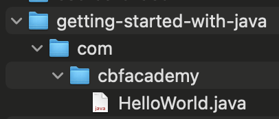
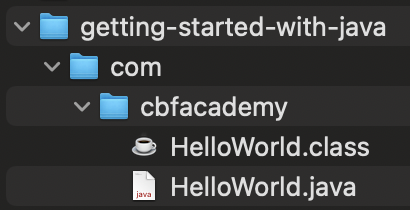

# Our First Java Program

[][1]

The goal of this exercise is to:
- create a simple Java project
- create a Java package
- create and run a simple Java program that prints `Hello World!` to the screen.


## Setup

In your preferred working directory,

- Create a project folder called **`getting-started-with-java`**.

- Inside this project folder:
    - create a sub-directory called **`com`**
    - inside the `com` directory, create a sub-directory called **`cbfacademy`**
    - inside the `codingblackfemales` directory, create a sub-directory called **`academy`**

- Inside that last sub-directory (`academy`), create a file called **`HelloWorld.java`**.

At this point, our project folder structure looks as follows:



## :wave: Hello World

Open the `HelloWorld.java` file in your code editor, type the following Java code, then save your changes.

```java
package com.cbfacademy;

public class HelloWorld {
    public static void main(String... args) {
        System.out.println("Hello World!");
    }
}

```

:hourglass: **Compile**

In your terminal, navigate to the `getting-started-with-java` project folder. 

Execute this command to **compile** our Java program

```bash
javac com/codingblackfemales/academy/HelloWorld.java
```

A `HelloWorld.class` file is now created alongside our Java source.



:runner: **Run**

To run our Java program, let's execute the following command in the same directory as before (`getting-started-with-java`)

```bash
java com.cbfacademy.HelloWorld
```

:tada: Our program prints the following on your screen.

```bash
Hello World!
```

## :memo: Note

With the above, we've just created and run our first, simple, Java program.

In this exercise, we've done all the work **manually** to get acquainted with the basics of creating, compiling and running a simple Java program.

In the rest of the course, we'll be using [Visual Studio Code][2] to help us with the build and execution process, and focus on the Java language itself.


[1]: https://docs.oracle.com/javase/8/docs/api/index.html
[2]: https://code.visualstudio.com/